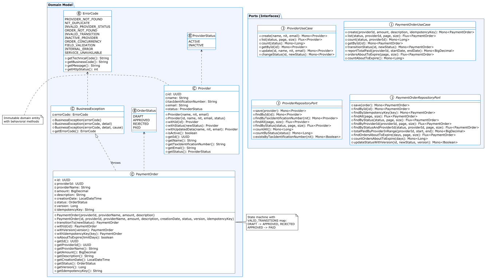
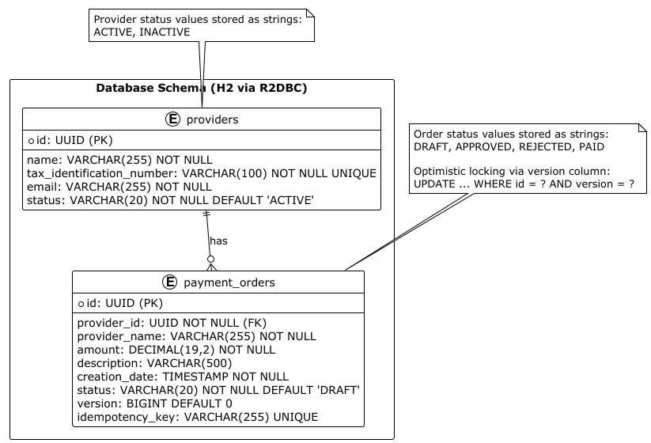
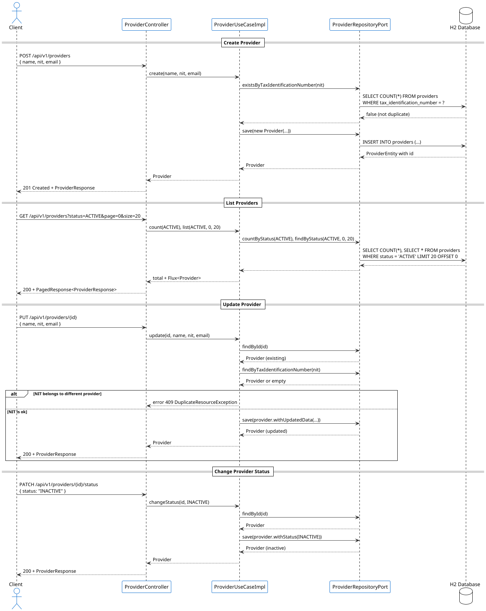
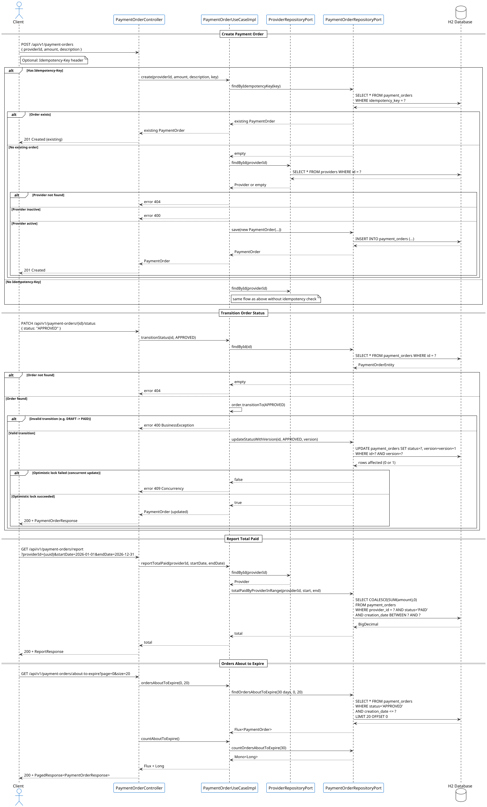

# Ginko Payments - Reactive Hexagonal Architecture

Reactive API for managing payments to providers.
**Hexagonal** architecture (ports and adapters) with **Spring WebFlux**, **R2DBC** and **Resilience4j**.

## Technology Stack

| Layer         | Technology                                          |
|---------------|-----------------------------------------------------|
| Language      | Java 17                                             |
| Framework     | Spring Boot 3.3.0                                   |
| Reactive      | Spring WebFlux + Project Reactor                    |
| Database      | H2 in-memory with R2DBC                             |
| Persistence   | Spring Data R2DBC                                   |
| Resilience    | Resilience4j (Circuit Breaker, Retry, Time Limiter) |
| Documentation | Springdoc OpenAPI 2.6.0 (Swagger UI)                |
| Build         | Maven                                               |
| Testing       | JUnit 5 + Mockito + Reactor Test + WebTestClient    |

## Prerequisites

- JDK 17+
- Maven 3.8+

## Run locally

```bash
cd ginko-payments
mvn clean spring-boot:run
```

The application starts at `http://localhost:8080`.

## Swagger UI

- **Swagger UI**: http://localhost:8080/api/v1/swagger-ui.html
- **OpenAPI spec**: http://localhost:8080/api/v1/api-docs

## Postman Collection

Import `docs/ginko-payments.postman_collection.json` into Postman to test all endpoints with predefined examples.

## Run tests

```bash
mvn clean test
```

## Endpoints

### Providers

| Method | Path                                    | Description                        |
|--------|-----------------------------------------|------------------------------------|
| POST   | `/api/v1/providers`                     | Create provider                    |
| GET    | `/api/v1/providers?status=&page=&size=` | List (paginated, filter by status) |
| GET    | `/api/v1/providers/{id}`                | Get by ID                          |
| PUT    | `/api/v1/providers/{id}`                | Update                             |
| PATCH  | `/api/v1/providers/{id}/status`         | Change status (ACTIVE/INACTIVE)    |

### Payment Orders

| Method | Path                                                            | Description                                |
|--------|-----------------------------------------------------------------|--------------------------------------------|
| POST   | `/api/v1/payment-orders`                                        | Create (optional `Idempotency-Key` header) |
| GET    | `/api/v1/payment-orders?status=&providerId=&page=&size=`        | List (paginated, filters)                  |
| GET    | `/api/v1/payment-orders/{id}`                                   | Get by ID                                  |
| PATCH  | `/api/v1/payment-orders/{id}/status`                            | Transition status                          |
| GET    | `/api/v1/payment-orders/report?providerId=&startDate=&endDate=` | Total paid by provider in range            |
| GET    | `/api/v1/payment-orders/about-to-expire?page=&size=`            | APPROVED orders older than 30 days         |

## Design Decisions

### Hexagonal architecture (ports and adapters)

The code is organized into three layers: **domain** (business core with no framework dependencies), **application** (use
cases, DTOs, exceptions), and **infrastructure** (REST and persistence adapters). This fully isolates business logic
from technical details.

### Reactive stack (WebFlux + R2DBC)

Spring WebFlux is used instead of Spring Web MVC to achieve a fully non-blocking pipeline from controller to database.
R2DBC replaces JPA for reactive database access to H2.

### Rich domain model

`Provider` and `PaymentOrder` are immutable domain objects with behavior, not simple data carriers.
`PaymentOrder.transitionTo()` encapsulates the state machine and validates allowed transitions.

### Centralized exception handling

`GlobalErrorWebExceptionHandler` catches all domain exceptions and translates them to consistent HTTP responses (400,
404, 409, 500). Domain exceptions (`ResourceNotFoundException`, `DuplicateResourceException`, `BusinessException`)
propagate directly without being wrapped by Resilience4j.

### Resilience4j

Resilience patterns: **Circuit Breaker** (prevents failure cascades), **Retry** (exponential backoff for transient
failures), and **Time Limiter** (5s timeout). Fallback methods preserve domain exceptions to maintain correct HTTP
responses.

### Idempotency with Idempotency-Key header

Order creation supports idempotency via the `Idempotency-Key` header. If a repeated key is received, the existing order
is returned with no side effects.

### Optimistic locking for concurrency control

Order state transitions use a `version` column with conditional updates (`UPDATE ... WHERE id = ? AND version = ?`). If
two concurrent requests try to modify the same order, one receives a descriptive 400 error.

### Manual mapping between layers

MapStruct/ModelMapper are avoided to keep code explicit and dependency-free. Mappings are localized in the
infrastructure adapters.

### H2 with R2DBC

H2 in-memory with the `r2dbc-h2` driver enables the full reactive stack without external infrastructure. Schema
initialization is done via `schema.sql`.

## Diagrams

### Domain Model — Class Diagram
Domain entities (`Provider`, `PaymentOrder`), enums, exceptions, and the port interfaces (use cases and repositories) that define the hexagonal architecture contracts.



### Database Schema — Entity-Relationship Model
Relational model of the H2 database: `providers` and `payment_orders` tables, their columns, constraints, and the foreign-key relationship between them.



### Provider Interaction — Sequence Diagram
End-to-end flows for creating, listing, updating, and changing the status of providers, including duplicate NIT validation.



### Payment Order Interaction — Sequence Diagram
End-to-end flows for creating payment orders (with idempotency support), transitioning status with optimistic locking, generating the total-paid report, and querying orders about to expire.



## Features Implemented

### Module 1 - Provider Management

- [x] Create with validation and NIT uniqueness
- [x] List with pagination and status filter
- [x] Get by ID
- [x] Update
- [x] Change status (ACTIVE/INACTIVE)

### Module 2 - Payment Order Management

- [x] Create with validations (active provider, amount > 0, description <= 250)
- [x] List with pagination, status and provider filters
- [x] Get by ID
- [x] Transition status (DRAFT -> APPROVED / REJECTED, APPROVED -> PAID)

### Module 3 - Cross-cutting Quality

- [x] Centralized exception handling (400, 404, 409, 500)
- [x] Descriptive JSON error responses
- [x] Swagger/OpenAPI at `/swagger-ui.html`
- [x] 19 unit tests (JUnit 5 + Mockito + Reactor Test)
- [x] 6 reactive integration tests (WebTestClient + H2 R2DBC)

### Module 4 - Additional Features

- [x] Report: total paid by provider in date range
- [x] Orders about to expire (rule: 30 days from creation, APPROVED status)
- [x] Idempotency (`Idempotency-Key` header)
- [x] Optimistic locking concurrency control (R2DBC)

### Resilience Patterns Applied

- [x] Circuit Breaker (10 sliding window, 50% threshold, 10s open state)
- [x] Retry (3 attempts, exponential backoff 500ms base)
- [x] Time Limiter (5s timeout)
- [x] Fallback methods preserving domain exceptions

### Health Checks & Metrics

- [x] Spring Boot Actuator (`/actuator/health`, `/actuator/info`, `/actuator/metrics`)
- [x] Prometheus endpoint (`/actuator/prometheus`)
- [x] Custom `MetricsConfig`: gauges for `providers.count` and `payment.orders.count`

## Pending

- Add authentication/authorization (Spring Security + JWT)
- Migrate to PostgreSQL/MySQL with containers for more realistic integration tests
- Add Colombian NIT format validation
- Add Rate Limiter per endpoint with Resilience4j
- Add automatic mapping with MapStruct if the number of DTOs grows
